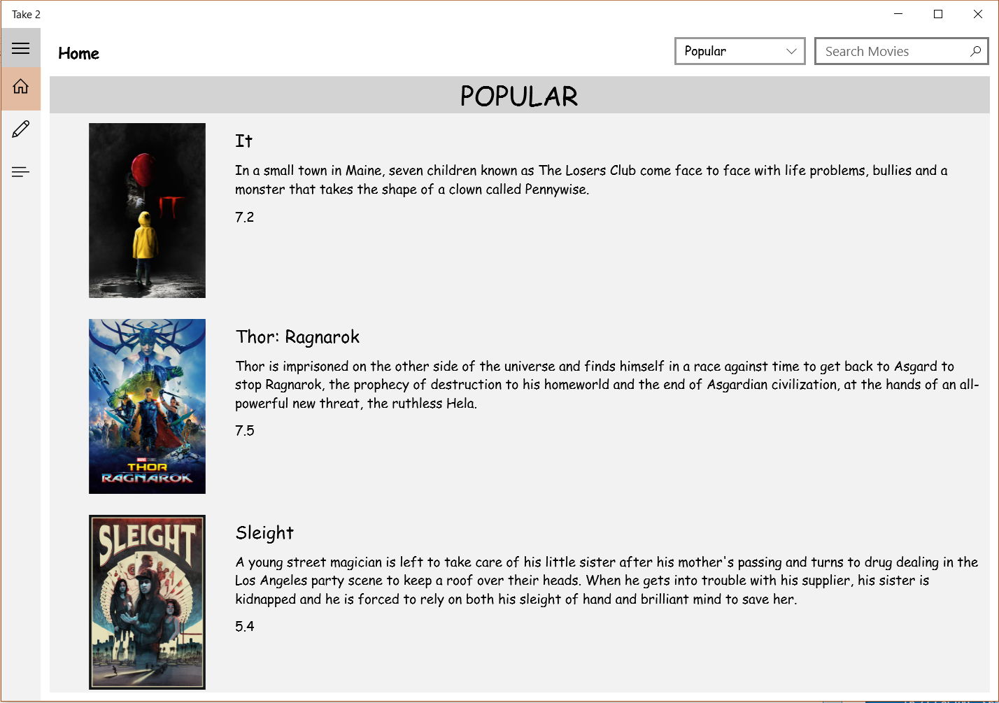
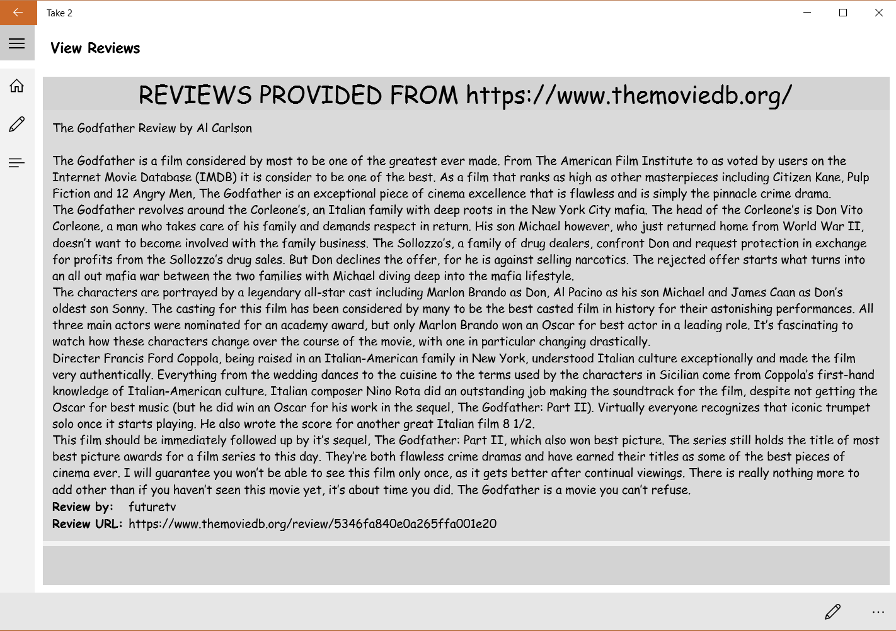
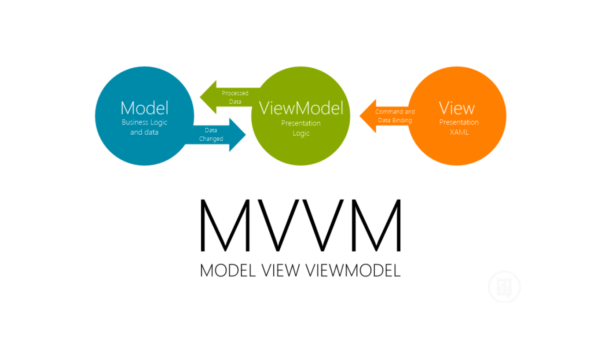

     

# UWP Forth Year Mobile Apps Project

## [Contents](#contents)      
* [Project Overview](#overview)         
* [MVVM](#mvvm)             
* [ASP.net App Service](#Webapp)   
* [API Used](#api)     
* [Using this Repo](#instructions)
* [References](#References)     

## Project Overview   
My name is [Patrick Moran](https://www.linkedin.com/in/patrick-moran-7a349014b/) and this is my project repository for my Fourth Year Mobile Apps Module.

Project Instructions:
>Create a Windows 10 UWP App. The application should incorporate the following elements:
* A responsive UI across the Windows 10 devices. There are some available for testing and
this includes the IoT core, mobile devices, tablet and PC. This includes Visual State
Management and using available SDKs for individual device types.
* A UI that has been well designed and is fit for purpose. User Experience should be carefully
considered while developing the application. The User Experience should be consistent
across devices.
* Mobile services for data storage and retrieval. The cloud service does not have to be written
in C# to be able to interact with a UWP. The preferred cloud to use is Azure.
* Use of the MVVM design pattern in the development approach.  

####  My Project
I've created a Movie Review UWP app, called Take 2.    
Users can: 
* App users can browse for movies by the following categories; Top-Rated, Popular and Upcoming; Or Search the API for for a specific movie.
* App users can then read reviews posted from the users of the [TMDB](https://www.themoviedb.org/) community.
* App users can also create and store their own movie reviews. These reviews are then shared between the users of my app.  

#### Application Screen Shots
  
 

[Top](#contents) 

## MVVM 
My project implements MVVM. Here are the basics behind Model View View Model (MVVM).   
* Model  
The Model interacts with the system and data services. It should know nothing about the view, or how it is implemented.
* View  
The View is where the user experience is created. In UWP app we use xaml to achive this. 
* View Model  
The View Model is the link between the view and the model. The view model encapsulates code or data that your view will use. It is not responsible for any business logic. 

The following diagram describes MVVM.  

  

[Top](#contents) 

## ASP. net App Service
 
In this application I created and hosted an Azure App Service along with an SQL database. Microsoft Azure is a cloud computing service used for building, testing, deploying and managing applications and services through a global network of Microsoft-managed data centers. Azure supports a range of operating systems, programming languages, frameworks, databases, and devices. More Information on Microsoft Azure can be found [ere](https://azure.microsoft.com/en-us/overview/what-is-azure/). 

[Top](#contents)  

## API Used 
The API I used in this application is [TMDB](https://www.themoviedb.org/). TMDB is a community built, movie and TV Database. All data has been added by its community of users. I found this service to be fantastic. The [API Documentation](https://developers.themoviedb.org/3/movies/get-top-rated-movies) is extensive and there is an excellent support section for developers. I would highly reccomend this API.

[Top](#contents) 

## Using this Repo 
This UWP was developed using [Visual Studio 2015 Community Edition](https://www.visualstudio.com/downloads/) on Windows 10.  

#### Minimum Requirements To Run
* Minimum Version: Windows 10 (10.0; Build 10586)
* Target Version: Windows 10 Anniversary Edition (10.0; Build 14393)

Clone or download this repository and open it in Visual Studio.

[Top](#contents)

## References  
#### Docs
* [The Movie DB](https://developers.themoviedb.org/3/movies/get-top-rated-movies)
* [UWP Docs](https://docs.microsoft.com/en-us/windows/uwp/)  
* [Azure](https://docs.microsoft.com/en-us/azure/)

#### Tutorials:  
* https://www.youtube.com/watch?v=SiaUzO72tqE&list=PLi2hbezQRVS0cPMeW3uDlUHnO_rPvJCV9  
* https://www.youtube.com/watch?v=PfnAqfgsvFc&list=LLglS-9dzs_PFia9xknMxtYQ&t=2180s&index=1  

[Top](#contents) 

